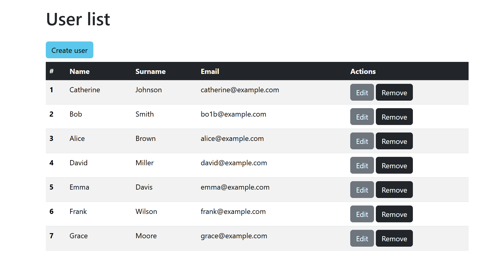
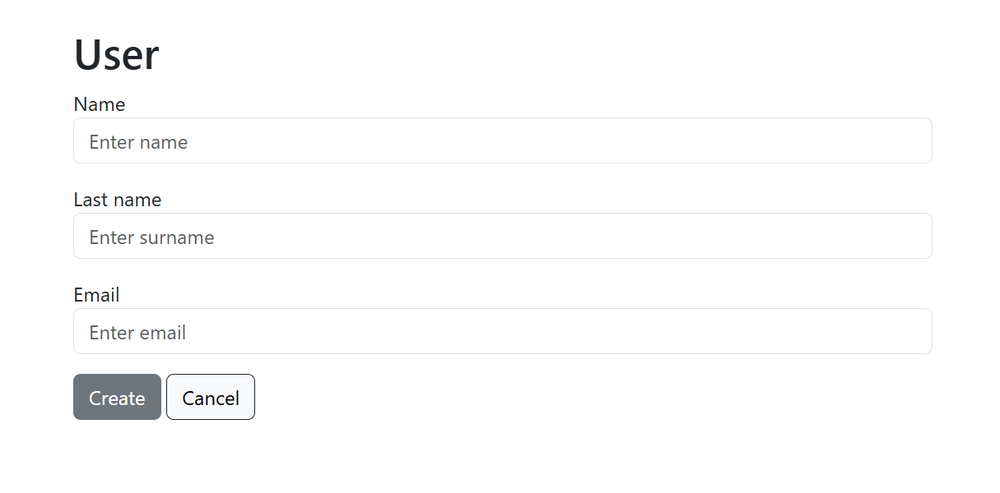

# Spring MVC + Hibernate

### Условия:
1. Написать CRUD-приложение. Использовать Spring MVC + Hibernate.
2. Должен быть класс User с произвольными полями (id, name и т.п.).
3. В приложении должна быть страница, на которую выводятся все юзеры с возможностью добавлять, удалять и изменять юзера.
4. Конфигурация Spring через JavaConfig и аннотации. Без использования xml. Без Spring Boot.
5. Внесите изменения в конфигурацию для работы с базой данных. Вместо SessionFactory должен использоваться EntityManager.

### Запуск проекта
1. Склонируйте проект `git clone https://github.com/sparklemod/spring-webmvc.git`
2. Запустите контейнер с БД `docker-compose up -d`
3. Запустите сервер Tomcat

Таблица и начальные данные создаются автоматически

